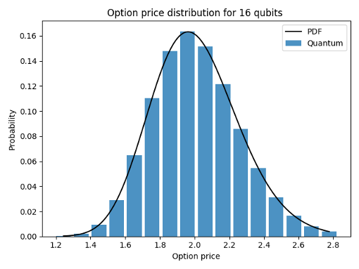

# Quantum unary approach to option pricing

Code at: [https://github.com/Quantum-TII/qibo/tree/master/examples/unary](https://github.com/Quantum-TII/qibo/tree/master/examples/unary)

Based in the paper [arXiv:1912.01618](https://arxiv.org/abs/1912.01618). In this `README.md` file you can see a short
set of instructions for the usage of the example.

#### What this example does?

This example provides a new strategy to compute the expected payoff of a given (European) option using quantum computing.
It is based on three previous results:
- the Black-Scholes model, a classical model that models the behavior of an asset in the market
- Amplitude Estimation, a quantum procedure to estimate the probability of obtaining some outcomes from a quantum circuit,
providing quantum advantage
- option pricing in quantum computers, a previous paper [arXiv:1905.02666](https://arxiv.org/abs/1905.02666)

The main feature of this procedure is to use the unary encoding of prices, that is, we work in the subspace of the
Hilbert space where only one qubit is in the |1> state. This allows for a simplification of the circuit and resilience
against errors, what makes the algorithm more suitable for NISQ devices. In contradistinction, it has an exponential
overhead in the number of qubits as compared to the standard approaches. That makes our algorithm more efficient only when the problem is not
very large.

The algorithm is divided in three steps. First, the probability distribution as computed in the Black-Scholes model is
loaded into the quantum circuit by means of an exact circuit using *iSWAP* gates. Then, the payoff is computed by applying
some controlled rotations on an ancilla qubit. Amplitude Estimation can be applied if the algorithm is applied and reversed
together with some extra operations to achieve quantum advantage.

#### Usage
In this example there are only three files
- `aux_functions.py` contains the classical functions that are needed to run the experiment.
- `functions.py` encodes all quantum circuits and procedures needed to run the circuits.
- `main.py` is the file calling all other functions. The action of every line of code is commented in the source code.

The parameters to be fixed for a run of the experiment are
- `S0`: initial price of the asset
- `K`: strike of the European option
- `sig`: volatility of the asset
- `r`: interest rate of the asset
- `T`: maturity date
- `shots`: number of times the quantum experiments are ran
- `bins`: number of bins (qubits) used for the experiment
- `max_m`: number of applications of the Q operator in Amplitude Estimation for the last step, increasing linearly (see
the original paper for more details)

#### Results

Three different results are presented in this example. First, it is shown how the amplitude distributor fits the predictions
of the Black-Scholes model. As more qubits are added to the simulation, the approximation gets closer to the classical prediction.



The second result is printed in the console after every run of the example. It returns the exact classical value of the
expected payoff, the expected payoff returned in the quantum experiment and the percentage error.
```bash
Exact value of the expected payoff:      0.15950474339651186

Expected payoff from quantum simulation: 0.16071698625159084

Percentage error: 0.7600042664972508 %
```

Finally, results in amplitude estimation are provided.

First, it is clear to see how the expected results converge to the
optimal quantum result. Notice that the optimal quantum result is not exactly the exact classical value. This is due to
discretization errors.


Second, it is worthy to study how the uncertainties in the outcomes evolve with the number of Amplitude Estimation
iterations. Here it is depicted how these uncertainties are always lower than the classical standard Monte Carlo ones, but
larger than the optimal quantum uncertainties. The reason is that the depth of the circuit is controlled to increase
linearly, in order to control de errors in the circuit.


The ultimate strength of this algorithm is its resilience to errors in the circuit. The figure below describes the errors
obtained for our algorithm (left) as compared to the method proposed in [arXiv:1905.02666](https://arxiv.org/abs/1905.02666) (right)
when noise is considered for 8 bins.


